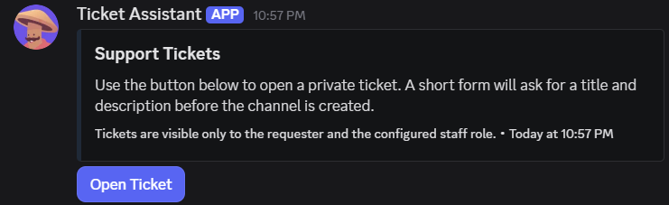
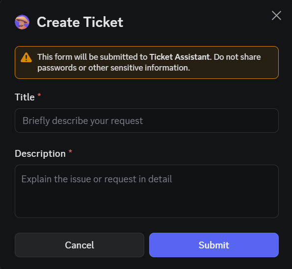
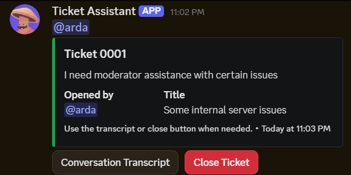
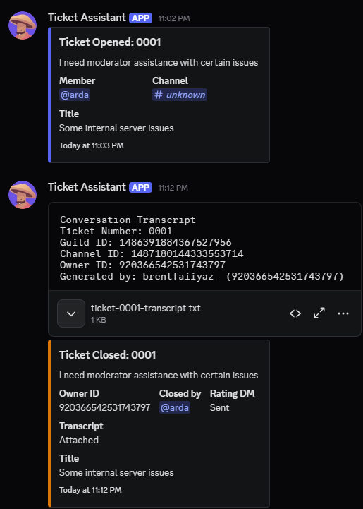
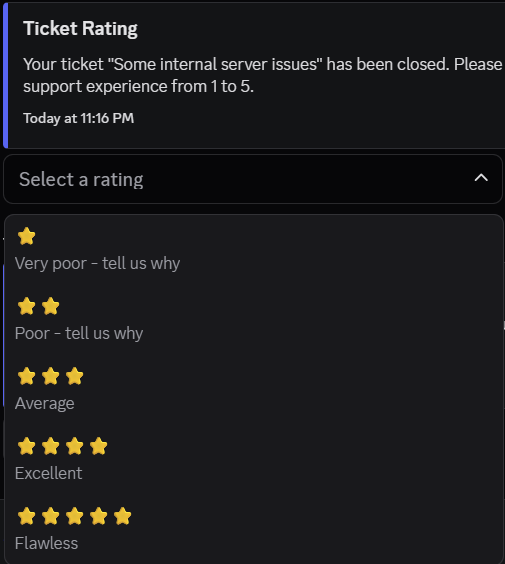

# TicketBot

TicketBot is a fully slash-command Discord.js v14 ticket bot for structured support workflows on Discord.
It uses quick.db with SQLite-backed local storage, keeps the codebase simple, and focuses on a clean, customizable, open-source friendly ticket system.

## Highlights

- Slash commands only
- Discord.js v14 architecture
- quick.db storage backed by SQLite
- Modal-based ticket creation
- Private ticket channels with role-based visibility
- Staff-only log channels under the ticket category
- Transcript generation on demand and on close
- DM-based rating flow with written feedback for low ratings
- Guild-based solved ticket statistics in `/stats`
- GitHub button inside `/stats`
- Editable ticket panel content and panel color
- Manual setup and automatic setup support
- Full reset command for guild ticket data

## Commands

### General

- `/help`
  Shows the help menu and command groups.

- `/ping`
  Shows gateway latency and round-trip time.

- `/stats`
  Shows server-specific ticket stats, runtime details, CPU, RAM, latency, version information, and a GitHub link button.

### Ticket Management

These commands are visible to members with the `Manage Messages` permission.

- `/setup-ticket`
  Creates or refreshes the ticket system.

- `/settings`
  Shows the current ticket configuration or updates the existing setup.

- `/reset`
  Fully removes the configured ticket system for the current guild and resets the ticket counter.

## Visual Walkthrough
### 1. System Panel



This is the main ticket panel users interact with before opening a request. It shows the panel embed, the opening button, and the clean entry point of the ticket workflow.

### 2. Ticket Creation Modal



The modal collects a clear ticket title and a required description before the channel is created. It helps the workflow feel structured from the first user interaction.

### 3. Active Ticket Channel



This view shows the live support channel after a ticket is created. Keeping the transcript and close actions visible makes the workflow immediately understandable.

### 4. Staff Log Channel



This view shows the private staff log with closure details and the transcript attachment in one place. It highlights that the system is built for moderation workflows, not only for opening tickets.

### 5. Rating Flow



This capture shows the post-ticket DM rating flow with star-based feedback options. It gives the project a polished end-to-end feel by showing how support quality is measured after closure.

## Ticket Workflow

### Setup

TicketBot supports both manual setup and automatic setup.

Manual setup:
- Use `/setup-ticket` with your preferred staff role, log channel, panel channel, and panel text values.
- If the selected log channel is outside the ticket category, the bot moves it under the category automatically.
- The log channel is permission-synced so only the configured staff role and the bot can see it.

Automatic setup:
- Run `/setup-ticket` without optional values.
- The bot creates the staff role, ticket category, and log channel when they do not already exist.
- The panel message is sent in the current text channel unless `panel-channel` is provided.

### Opening a Ticket

1. A member presses the ticket panel button.
2. A modal opens.
3. The member must enter:
   - a title with at least 5 characters
   - a description with at least 20 characters
4. The bot creates a private ticket channel under the configured ticket category.
5. Only these targets can see the channel:
   - the ticket opener
   - the configured staff role
   - the bot
6. The ticket message includes:
   - `Conversation Transcript`
   - `Close Ticket`

### Transcript Flow

The `Conversation Transcript` button generates a plain text transcript for the current ticket and returns it as an ephemeral file.
When a ticket closes, a transcript is also generated automatically and uploaded to the log channel.

Transcript output includes:
- date
- time
- day name
- ticket number
- username
- message content
- attachment URLs when present
- embed summaries when present

Example line format:

```text
[26.03.2026 18:25:10 Thursday] [Ticket 0001] [username]: message content
```

### Closing and Rating

When a ticket is closed:
- the ticket is marked as closed in quick.db
- a close log embed is sent to the log channel
- the transcript file is uploaded to the log channel
- the ticket opener receives a DM rating menu
- the ticket channel is deleted after 10 seconds by default

Rating meanings:
- `&#11088;` - Very poor
- `&#11088;&#11088;` - Poor
- `&#11088;&#11088;&#11088;` - Average
- `&#11088;&#11088;&#11088;&#11088;` - Excellent
- `&#11088;&#11088;&#11088;&#11088;&#11088;` - Flawless

Rating behavior:
- 1 or 2 stars open a required feedback modal
- 3, 4, or 5 stars are saved immediately
- ratings are stored in quick.db
- rating logs are forwarded to the ticket log channel

## Configuration

Edit `config.json` before starting the bot.

```json
{
  "token": "YOUR_BOT_TOKEN",
  "clientId": "YOUR_CLIENT_ID",
  "developerId": "YOUR_DEVELOPER_ID",
  "embedColors": {
    "primary": "#5865F2",
    "success": "#16A34A",
    "error": "#DC2626",
    "warning": "#D97706"
  },
  "ticket": {
    "panelColor": "#1F2937",
    "panelTitle": "Support Tickets",
    "panelDescription": "Use the button below to open a private ticket. A short form will ask for a title and description before the channel is created.",
    "panelFooter": "Tickets are visible only to the requester and the configured staff role.",
    "buttonLabel": "Open Ticket",
    "closeButtonLabel": "Close Ticket",
    "staffRoleName": "Ticket Staff",
    "categoryName": "Tickets",
    "logChannelName": "ticket-logs",
    "deleteDelaySeconds": 10
  }
}
```

Notes:
- `embedColors.primary` is the stable bot embed color.
- `ticket.panelColor` only affects the ticket panel embed.
- `deleteDelaySeconds` controls how long the ticket channel stays open after closure.

## Installation

1. Install dependencies:

```bash
npm install
```

2. Fill `config.json` with your real values.

3. Start the bot:

```bash
npm start
```

Optional local starter:

```bat
start.bat
```

Optional validation:

```bash
npm run check
```

## Required Bot Permissions

The bot should have at least these permissions:

- View Channels
- Send Messages
- Read Message History
- Embed Links
- Attach Files
- Manage Channels
- Manage Roles

The bot role must be placed above the roles it needs to manage.
If the bot role is not high enough, ticket setup and ticket creation are intentionally blocked.

## Logging

Startup logs are intentionally plain.
Examples:

- `[Database] Connected: quick.db (storage/ticketbot.sqlite)`
- `[Event] Loaded: ready.js`
- `[Command] Loaded: setup-ticket.js`
- `[Button] Loaded: transcriptTicket.js`

## Slash Command Registration

Application commands are registered globally when the bot becomes ready.
Discord may take a short time to refresh global slash commands after a restart.

## Project Structure

```text
app.js
config.json
start.bat
assets/
  screenshots/
src/
  commands/
    general/
    system/
  components/
    buttons/
    modals/
    selects/
  database/
    quickdb.js
  events/
    client/
  handlers/
  utils/
```

## License

This project is released under the MIT License.


